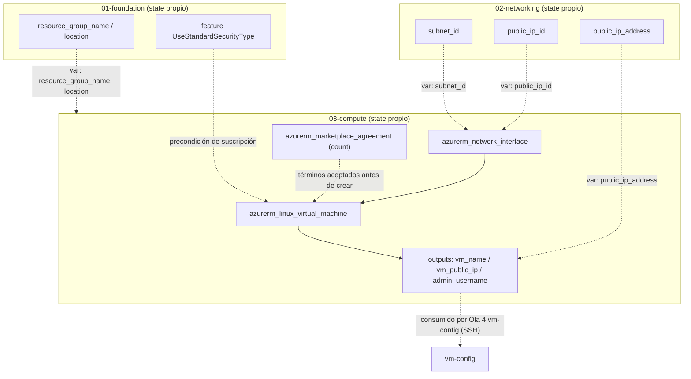
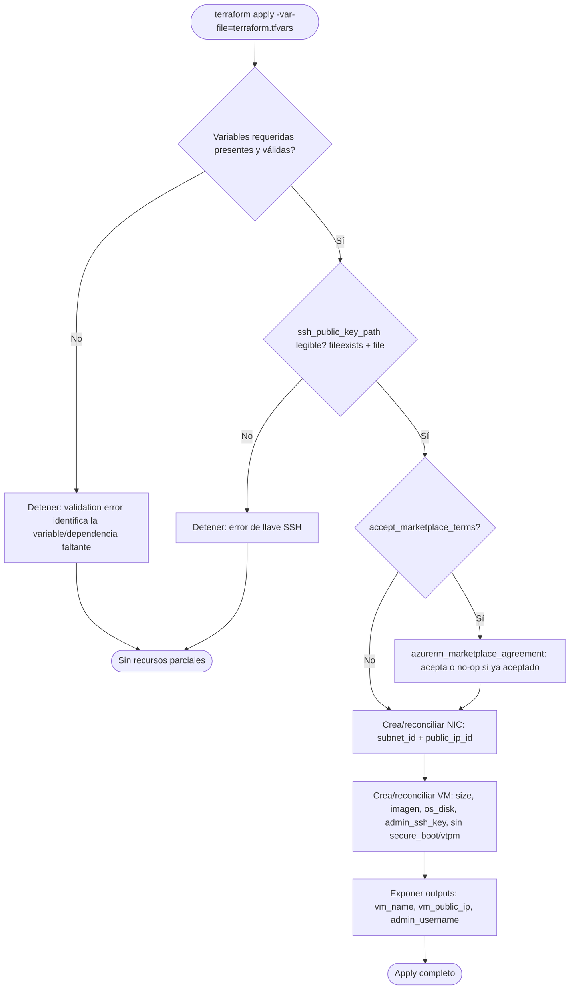

# Design Document — Capa `compute`

## Overview

**Propósito**: La capa `compute` (Ola 3, `terraform/03-compute/`) provisiona la máquina virtual GPU del laboratorio de LLMs y su conectividad de red, dejándola lista para la fase de configuración de software. Traduce los recursos de red y base ya creados (`networking`, `foundation`) en una VM `Standard_NC40ads_H100_v5` con imagen HPC Ubuntu 24.04, disco de sistema, autenticación SSH por llave pública y aceptación idempotente de términos de imagen.

**Usuarios**: El desarrollador que opera el laboratorio ejecuta `terraform apply` remotamente contra Azure. La fase posterior (`vm-config`, Ola 4) consume los outputs de esta capa (nombre de VM, IP pública, usuario admin) para conectarse por SSH y ejecutar los scripts de instalación.

**Impacto**: Añade un tercer directorio Terraform independiente con su propio state, siguiendo el patrón por capas del proyecto. No modifica `foundation` ni `networking`; consume sus outputs como variables de entrada, sin redeclarar recursos.

### Goals
- Provisionar de forma idempotente la NIC, la VM GPU, el disco OS y la autenticación SSH.
- Aceptar los términos de imagen Marketplace sin fallar cuando ya están aceptados o cuando la imagen no los requiere.
- Parametrizar por completo la capa (sin valores hardcodeados) y exponer outputs estables para la Ola 4.
- Mantener consistencia total con el patrón de `01-foundation` y `02-networking`.

### Non-Goals
- Crear el grupo de recursos, registrar features/providers (Ola 1) o la red/NSG (Ola 2).
- Configurar el interior de la VM: instalar Ollama, montar NVMe, descargar modelos (Ola 4).
- Destruir el laboratorio o documentar operación diaria (Ola 5).
- Gestionar la generación de la llave SSH (la produce el operador fuera de Terraform, según la guía).

## Boundary Commitments

### This Spec Owns
- La interfaz de red (`azurerm_network_interface`) asociada a la subred y a la IP pública de `networking`.
- La aceptación de términos de la imagen Marketplace (`azurerm_marketplace_agreement`, condicional).
- La máquina virtual Linux GPU (`azurerm_linux_virtual_machine`): tamaño, imagen, disco OS, usuario admin, autenticación SSH, tipo de seguridad Standard.
- Los outputs `vm_name`, `vm_public_ip`, `admin_username` como contrato para la Ola 4.
- La declaración completa de variables de entrada y la plantilla `terraform.tfvars.example`.

### Out of Boundary
- Grupo de recursos, región y registro de la feature `UseStandardSecurityType` (propiedad de `foundation`).
- VNet, subred, IP pública y NSG con sus reglas (propiedad de `networking`).
- Configuración interna del SO, Ollama, NVMe y modelos (propiedad de `vm-config`).
- Destrucción de recursos y documentación operativa (propiedad de `teardown-docs`).

### Allowed Dependencies
- Outputs de `foundation`: `resource_group_name`, `location`.
- Outputs de `networking`: `subnet_id`, `public_ip_id`, `public_ip_address`.
- Feature de suscripción `UseStandardSecurityType` (registrada por `foundation`), consumida implícitamente.
- Provider `azurerm >= 4.0`, Terraform `>= 1.5`.
- Restricción: el consumo es unidireccional (mediante variables manuales); `compute` **no** lee ni gestiona el state de las capas previas y **no** usa `terraform_remote_state`.

### Revalidation Triggers
- Cambio en los nombres/tipos de outputs de `foundation` o `networking` que alimentan las variables de `compute`.
- Recreación de la IP pública en `networking` (cambia `public_ip_id`/`public_ip_address`).
- Cambio de nombre/tipo de los outputs `vm_name`, `vm_public_ip`, `admin_username` (afecta a la Ola 4).
- Cambio en el prerequisito de tipo de seguridad (des-registro de `UseStandardSecurityType`) o migración de la imagen a un URN que requiera Trusted Launch.

## Architecture

### Existing Architecture Analysis

`compute` es una **extensión** que integra con dos capas Terraform ya implementadas:

- **Patrón de consumo entre capas** (a preservar): `02-networking` recibe `resource_group_name`/`location` como **variables manuales** con `validation` no vacía y `error_message` que apunta a `terraform -chdir=../01-foundation output -raw <name>`. `compute` replica exactamente este mecanismo para las cinco variables que consume de capas previas. No se usa `terraform_remote_state` (mantiene independencia de state).
- **Bloque de providers y autenticación** (a reutilizar textualmente): `providers.tf` con `required_version >= 1.5`, `azurerm >= 4.0`, `resource_provider_registrations = "none"` y variables `subscription_id/client_id/client_secret/tenant_id` (defaults `null`, fallback a `ARM_*`).
- **Estándares preservados**: nombrado `prefijo-funcion` para recursos Azure, `snake_case` para variables/outputs, `kebab-case.tf` para archivos, plantilla `.tfvars.example` versionada, `.tfvars` excluido de git, idempotencia por diseño declarativo.

### Architecture Pattern & Boundary Map



**Architecture Integration**:
- **Patrón seleccionado**: Capa Terraform independiente con consumo de dependencias por variables manuales validadas (patrón vigente del proyecto).
- **Fronteras de dominio**: `compute` solo crea NIC + agreement + VM; las dependencias upstream se inyectan por variable, no se redeclaran.
- **Patrones preservados**: providers/auth idénticos a capas previas, nombrado y separación código/valores.
- **Nuevos componentes**: NIC (conectividad de la VM), agreement condicional (términos), VM (cómputo GPU). Cada uno mapea 1:1 a un requisito.
- **Cumplimiento de steering**: idempotencia declarativa, sin secretos hardcodeados, `fmt`/`validate` limpios.

### Technology Stack

| Layer | Choice / Version | Role in Feature | Notes |
|-------|------------------|-----------------|-------|
| IaC | Terraform HCL `>= 1.5` | Declaración de NIC, agreement y VM | Igual que `01`/`02` |
| Provider | `hashicorp/azurerm >= 4.0` | Recursos Azure Compute/Network | `resource_provider_registrations = "none"` |
| Compute | `Standard_NC40ads_H100_v5` | VM GPU H100 NVL 94 GB | Vía variable `vm_size` |
| Imagen | `microsoft-dsvm:ubuntu-hpc:2404:latest` | SO con drivers NVIDIA/CUDA | 4 campos por variable |
| Almacenamiento | `StandardSSD_LRS`, 64 GB | Disco OS | Vía variables `os_disk_*` |
| Autenticación | SSH por llave pública | Acceso a la VM | `file(var.ssh_public_key_path)`, sin password |

## File Structure Plan

### Directory Structure
```
terraform/03-compute/
├── providers.tf              # Terraform/azurerm + auth (copia textual del patrón de 01/02)
├── variables.tf              # Todas las variables de entrada con tipo, descripción, validación
├── main.tf                   # azurerm_network_interface, azurerm_marketplace_agreement, azurerm_linux_virtual_machine
├── outputs.tf                # vm_name, vm_public_ip, admin_username
└── terraform.tfvars.example  # Plantilla versionada, sin valores reales
```

### Modified Files
- Ninguno. `compute` es un directorio nuevo autocontenido; no modifica `01-foundation`, `02-networking`, ni la raíz. El `.gitignore` existente ya cubre `*.tfvars` (excepto `.example`), `*.tfstate*`, `.terraform/` y `*.pem`/`*.pub`.

> Cada archivo tiene una responsabilidad única, replicando la organización de `02-networking`. No se requieren `data.tf` (no hay data sources) ni archivos adicionales.

## System Flows

Flujo de un `terraform apply` (creación / reconciliación idempotente):



Notas de gating:
- La validación de variables ocurre antes de cualquier llamada a Azure (REQ 1.4, 5.4, 7.5): una dependencia faltante detiene el plan/apply sin crear recursos.
- El agreement se evalúa por `count`; si ya existe, el apply es no-op (REQ 3.2). Un segundo apply sin cambios reporta cero cambios (REQ 8.1).

## Requirements Traceability

| Requirement | Summary | Components | Interfaces | Flows |
|-------------|---------|------------|------------|-------|
| 1.1 | RG/región desde `foundation` | Variables `resource_group_name`, `location` | validation + error_message | Validación inicial |
| 1.2 | subnet_id/public_ip_id desde `networking` | Variables `subnet_id`, `public_ip_id` | validation + error_message | Validación inicial |
| 1.3 | Recursos dentro del RG/región de `foundation` | NIC, VM | `resource_group_name`/`location` | Creación |
| 1.4 | Fallar si falta dependencia | Variables validadas | validation no vacía | ERRVAR |
| 2.1 | NIC en la subred | `azurerm_network_interface` | `ip_configuration.subnet_id` | NIC |
| 2.2 | Asociar IP pública a NIC | `azurerm_network_interface` | `ip_configuration.public_ip_address_id` | NIC |
| 2.3 | Nombrar NIC `prefijo-funcion` | NIC | `var.nic_name` | NIC |
| 2.4 | Tags en NIC por variable | NIC | `var.tags` | NIC |
| 3.1 | Aceptar términos Marketplace | `azurerm_marketplace_agreement` | `publisher/offer/plan` | AGREE |
| 3.2 | No fallar si ya aceptados | `azurerm_marketplace_agreement` | `count` + idempotencia | AGREE |
| 4.1 | VM con size/imagen/security por variable | `azurerm_linux_virtual_machine` | `size`, `source_image_reference` | VM |
| 4.2 | Disco OS por variable | VM | `os_disk` | VM |
| 4.3 | Asociar NIC a VM | VM | `network_interface_ids` | VM |
| 4.4 | Idempotencia de la VM | VM | estado declarativo | DONE |
| 4.5 | Nombrar VM `prefijo-funcion` | VM | `var.vm_name` | VM |
| 4.6 | Tags en VM por variable | VM | `var.tags` | VM |
| 4.7 | Security Standard vía feature de `foundation` | VM | omitir `secure_boot_enabled`/`vtpm_enabled` | VM |
| 5.1 | Usuario admin por variable | VM | `admin_username` | VM |
| 5.2 | SSH por llave pública | VM | `admin_ssh_key.public_key = file(...)` | KEY→VM |
| 5.3 | Deshabilitar password | VM | `disable_password_authentication = true` | VM |
| 5.4 | Fallar si llave inválida | Variable + VM | `fileexists` validation + `file()` | ERRKEY |
| 6.1 | Outputs vm_name/ip/usuario | outputs.tf | `vm_name`, `vm_public_ip`, `admin_username` | OUTS |
| 6.2 | Outputs `snake_case` estables | outputs.tf | nombres descriptivos | OUTS |
| 6.3 | Solo info no sensible | outputs.tf | sin secretos | OUTS |
| 7.1 | Todo valor como variable tipada | variables.tf | `type` + `description` | — |
| 7.2 | Defaults seguros omitibles | variables.tf | `default` en no sensibles | — |
| 7.3 | Plantilla versionada sin valores reales | `terraform.tfvars.example` | placeholders | — |
| 7.4 | Valores reales en `.tfvars` fuera de git | `.gitignore` | `*.tfvars` excluido | — |
| 7.5 | Fallar si falta variable sin default | variables.tf | variable sin `default` | ERRVAR |
| 8.1 | Cero cambios tras apply | Toda la capa | idempotencia declarativa | DONE |
| 8.2 | `fmt`/`validate` limpios | Toda la capa | estándar Terraform | — |
| 8.3 | Reconciliar recurso ausente | Toda la capa | reconciliación de state | Creación |
| 8.4 | Código separado de valores | Estructura de archivos | `variables.tf` vs `.tfvars` | — |

## Components and Interfaces

| Component | Layer | Intent | Req Coverage | Key Dependencies | Contracts |
|-----------|-------|--------|--------------|------------------|-----------|
| `azurerm_network_interface.main` | Network | Conectividad de la VM a subred + IP pública | 2.1–2.4, 4.3 | `subnet_id`, `public_ip_id` (P0) | State |
| `azurerm_marketplace_agreement.main` | Compute/Legal | Aceptar términos de imagen | 3.1, 3.2 | `image_*`, `accept_marketplace_terms` (P1) | State |
| `azurerm_linux_virtual_machine.main` | Compute | VM GPU con disco/SSH/Standard | 4.1–4.7, 5.1–5.4 | NIC (P0), agreement (P1), feature de suscripción (P0) | State |
| Variables de entrada | Config | Parametrización total + consumo de capas previas | 1.x, 7.x | outputs de `foundation`/`networking` (P0) | State/Input |
| Outputs | Contract | Datos para la Ola 4 | 6.1–6.3 | VM, `public_ip_address` | State/Output |

### Network

#### `azurerm_network_interface.main`

| Field | Detail |
|-------|--------|
| Intent | Crear la NIC que conecta la VM a la subred de `networking` y le asocia la IP pública estática |
| Requirements | 2.1, 2.2, 2.3, 2.4, 4.3 |

**Responsibilities & Constraints**
- Crear una NIC en el RG/región de `foundation`, con un `ip_configuration` que referencia `var.subnet_id` y `var.public_ip_id`.
- Nombrar la NIC con `var.nic_name` (convención `prefijo-funcion`) y aplicar `var.tags`.
- No asocia NSG (el NSG lo asocia `networking` a la subred; equivale a `--nsg-rule NONE` de la guía).

**Dependencies**
- Inbound: VM — la NIC se referencia en `network_interface_ids` (P0).
- Outbound: `networking` — `subnet_id`, `public_ip_id` vía variables (P0).

**Contracts**: State [x]

##### State Management
```hcl
resource "azurerm_network_interface" "main" {
  name                = var.nic_name
  location            = var.location
  resource_group_name = var.resource_group_name
  tags                = var.tags

  ip_configuration {
    name                          = "internal"
    subnet_id                     = var.subnet_id
    private_ip_address_allocation = "Dynamic"
    public_ip_address_id          = var.public_ip_id
  }
}
```
- Preconditions: `subnet_id` y `public_ip_id` válidos (validados en variables).
- Postconditions: NIC lista para asociarse a la VM.
- Invariants: idempotente; sin cambios en applies subsiguientes.

### Compute

#### `azurerm_marketplace_agreement.main`

| Field | Detail |
|-------|--------|
| Intent | Aceptar los términos de la imagen Marketplace de forma idempotente y condicional |
| Requirements | 3.1, 3.2 |

**Responsibilities & Constraints**
- Aceptar términos para `publisher = var.image_publisher`, `offer = var.image_offer`, `plan = coalesce(var.image_plan_name, var.image_sku)`.
- Controlado por `count = var.accept_marketplace_terms ? 1 : 0` para no fallar cuando la imagen no tiene términos (p. ej. `ubuntu-hpc`); el default `false` mantiene el camino feliz para la imagen HPC.
- Idempotente: si el agreement ya existe, el apply es no-op.

**Contracts**: State [x]

##### State Management
```hcl
resource "azurerm_marketplace_agreement" "main" {
  count     = var.accept_marketplace_terms ? 1 : 0
  publisher = var.image_publisher
  offer     = var.image_offer
  plan      = coalesce(var.image_plan_name, var.image_sku)
}
```
- Preconditions: con `accept_marketplace_terms = true`, la imagen expone un plan de Marketplace (indicado por `image_plan_name` o, en su defecto, el SKU). Default `false` para `ubuntu-hpc`, que no requiere términos.
- Postconditions: términos aceptados a nivel de suscripción antes de crear la VM.
- Invariants: no recrea el agreement en applies subsiguientes.

**Implementation Notes**
- Risks: si `accept_marketplace_terms = true` y la imagen carece de plan, el apply falla. Mitigado con default `false` (la imagen HPC `ubuntu-hpc:2404` no tiene plan de Marketplace); el operador solo lo activa para imágenes de pago que sí requieran términos.
- Plan name: `plan` usa `coalesce(var.image_plan_name, var.image_sku)`. Para muchas imágenes el `plan` coincide con el SKU, pero en imágenes de pago puede diferir; `image_plan_name` permite sobrescribirlo sin editar código.

#### `azurerm_linux_virtual_machine.main`

| Field | Detail |
|-------|--------|
| Intent | Provisionar la VM GPU con imagen HPC, disco OS, SSH y tipo de seguridad Standard |
| Requirements | 4.1–4.7, 5.1, 5.2, 5.3, 5.4 |

**Responsibilities & Constraints**
- Crear la VM con `size = var.vm_size`, imagen por `source_image_reference` (4 campos por variable) y disco OS por `os_disk`.
- Asociar la NIC creada (`network_interface_ids`).
- Usuario admin `var.admin_username`; llave SSH `file(var.ssh_public_key_path)`; `disable_password_authentication = true`.
- Tipo de seguridad Standard: **omitir** `secure_boot_enabled`/`vtpm_enabled`; depende de la feature `UseStandardSecurityType` (registrada por `foundation`, no redeclarada aquí).
- Nombrar con `var.vm_name` y aplicar `var.tags`.

**Dependencies**
- Inbound: outputs (`vm_name`, `vm_public_ip`, `admin_username`) (P0).
- Outbound: NIC (P0), agreement (P1), feature de suscripción (P0).
- External: imagen Marketplace `microsoft-dsvm:ubuntu-hpc:2404` (P0).

**Contracts**: State [x]

##### State Management
```hcl
resource "azurerm_linux_virtual_machine" "main" {
  name                            = var.vm_name
  location                        = var.location
  resource_group_name             = var.resource_group_name
  size                            = var.vm_size
  admin_username                  = var.admin_username
  disable_password_authentication = true
  network_interface_ids           = [azurerm_network_interface.main.id]
  tags                            = var.tags

  admin_ssh_key {
    username   = var.admin_username
    public_key = file(var.ssh_public_key_path)
  }

  os_disk {
    caching              = "ReadWrite"
    storage_account_type = var.os_disk_storage_account_type
    disk_size_gb         = var.os_disk_size_gb
  }

  source_image_reference {
    publisher = var.image_publisher
    offer     = var.image_offer
    sku       = var.image_sku
    version   = var.image_version
  }

  depends_on = [azurerm_marketplace_agreement.main]
}
```
- Preconditions: NIC creada, términos aceptados (si aplican), feature Standard registrada, llave SSH legible.
- Postconditions: VM en ejecución, accesible por SSH en la IP pública estática.
- Invariants: idempotente; un `plan` posterior sin cambios reporta cero diferencias.

**Implementation Notes**
- Integration: `depends_on` sobre el agreement asegura el orden términos → VM incluso con `count = 0` (lista vacía es dependencia válida).
- Validation: `disable_password_authentication = true` y ausencia de `secure_boot_enabled`/`vtpm_enabled` son explícitos y verificables por revisión.
- Risks: la creación fallará (sin recursos parciales de VM) si la feature Standard no está registrada; comportamiento aceptable y documentado.

### Config / Contracts

#### Variables de entrada (variables.tf)

Categorías (todas `snake_case`, con `type` y `description`; REQ 7.1):

| Variable | Tipo | Default | Origen / Nota |
|----------|------|---------|---------------|
| `subscription_id` | string | — | Auth (copia del patrón de `01`/`02`) |
| `client_id` / `client_secret` / `tenant_id` | string | `null` (sensitive) | Auth; fallback `ARM_*` |
| `resource_group_name` | string | — | Output de `foundation`; `validation` no vacía |
| `location` | string | `"eastus2"` | Output de `foundation` |
| `subnet_id` | string | — | Output de `networking`; `validation` no vacía |
| `public_ip_id` | string | — | Output de `networking`; `validation` no vacía |
| `public_ip_address` | string | — | Output de `networking`; re-expuesto como output |
| `nic_name` | string | `"vm-ollama-h100-nic"` | Nombre `prefijo-funcion` |
| `vm_name` | string | `"vm-ollama-h100"` | Nombre `prefijo-funcion` |
| `vm_size` | string | `"Standard_NC40ads_H100_v5"` | Tamaño GPU |
| `admin_username` | string | `"azureuser"` | Usuario admin |
| `ssh_public_key_path` | string | — | `validation` con `fileexists(...)` (REQ 5.4) |
| `image_publisher` | string | `"microsoft-dsvm"` | Imagen |
| `image_offer` | string | `"ubuntu-hpc"` | Imagen |
| `image_sku` | string | `"2404"` | Imagen / `plan` del agreement |
| `image_version` | string | `"latest"` | Imagen |
| `os_disk_size_gb` | number | `64` | Disco OS |
| `os_disk_storage_account_type` | string | `"StandardSSD_LRS"` | Disco OS |
| `accept_marketplace_terms` | bool | `false` | Gate del agreement (REQ 3); `false` seguro para `ubuntu-hpc` (sin plan de Marketplace) |
| `image_plan_name` | string | `null` | Nombre del `plan` del agreement; solo requerido si `accept_marketplace_terms = true`. Para imágenes de pago puede diferir del SKU |
| `tags` | map(string) | `{}` | Etiquetas de NIC y VM |

- Preconditions: variables sin `default` (`subscription_id`, `resource_group_name`, `subnet_id`, `public_ip_id`, `public_ip_address`, `ssh_public_key_path`) detienen el apply si faltan (REQ 7.5).
- `validation` en las variables de dependencia usa `length(trimspace(...)) > 0` con `error_message` que apunta a `terraform -chdir=../01-foundation output -raw <name>` o `../02-networking output -raw <name>` (REQ 1.4).
- `ssh_public_key_path`: `validation` con `fileexists(var.ssh_public_key_path)` y `error_message` claro (REQ 5.4).

#### Outputs (outputs.tf)

| Output | Valor | Requisito |
|--------|-------|-----------|
| `vm_name` | `azurerm_linux_virtual_machine.main.name` | 6.1, 6.2 |
| `vm_public_ip` | `var.public_ip_address` | 6.1, 6.2 |
| `admin_username` | `var.admin_username` | 6.1, 6.2 |

- Todos `snake_case`, descriptivos, sin información sensible (REQ 6.2, 6.3). No se exponen la llave privada ni credenciales.

## Error Handling

### Error Strategy
Fallo temprano y explícito en la fase de validación/plan de Terraform, **antes** de crear cualquier recurso, evitando estados parciales.

### Error Categories and Responses
- **Dependencia faltante** (REQ 1.4, 7.5): variable requerida vacía/ausente → `validation`/prompt detiene el apply citando la variable y el comando `terraform -chdir=../0X output` para obtenerla.
- **Llave SSH inválida** (REQ 5.4): ruta ilegible → `fileexists` validation o `file()` aborta con mensaje identificando el archivo; la VM no se crea.
- **Feature Standard no registrada**: la API de Azure rechaza la creación Standard → apply falla sin crear la VM; se documenta la precondición (responsabilidad de `foundation`).
- **Términos Marketplace inexistentes**: si `accept_marketplace_terms = true` sobre imagen sin plan → error del agreement; mitigado por el gate booleano con default `false` (la imagen HPC no requiere términos).

### Monitoring
No aplica monitoreo runtime en esta capa (IaC declarativa). La verificación es `terraform plan` (cero cambios), `terraform validate` y `terraform fmt -check`.

## Testing Strategy

### Validación estructural (IaC)
- `terraform fmt -check` y `terraform validate` limpios en `terraform/03-compute/` (REQ 8.2).
- `terraform plan` con variables mínimas requeridas: verificar que las variables sin default detienen el plan con mensaje claro cuando faltan (REQ 7.5, 1.4).

### Pruebas de idempotencia
- Tras un `apply` exitoso, un `plan` inmediato sin cambios reporta 0 add / 0 change / 0 destroy (REQ 8.1, 4.4).
- Segundo `apply` con `accept_marketplace_terms = true` y términos ya aceptados: no-op del agreement (REQ 3.2).

### Pruebas de integración de dependencias
- Con `resource_group_name`/`subnet_id`/`public_ip_id` provenientes de outputs reales de `01`/`02`: la NIC se asocia a la subred correcta y la VM recibe la IP pública estática (REQ 1.x, 2.1, 2.2).
- Ausencia de una variable de dependencia: el apply se detiene con `error_message` que identifica la dependencia (REQ 1.4).

### Pruebas de autenticación y seguridad
- `ssh_public_key_path` inexistente: el apply falla en validación sin crear la VM (REQ 5.4).
- Verificar por revisión que `disable_password_authentication = true` y que no existen `secure_boot_enabled`/`vtpm_enabled` (REQ 5.3, 4.7).
- Conexión SSH real a la IP pública con la llave privada correspondiente confirma acceso solo por llave (REQ 5.1–5.3).

## Security Considerations
- **Autenticación solo por llave SSH**: `disable_password_authentication = true`; la llave privada nunca entra a Terraform ni al repositorio (`*.pem`/`*.pub` en `.gitignore`).
- **Sin secretos en outputs**: los outputs exponen solo nombre de VM, IP pública y usuario (REQ 6.3).
- **Sin valores hardcodeados sensibles**: credenciales del provider vía `ARM_*`/`.tfvars` excluido; plantilla `.tfvars.example` solo con placeholders (REQ 7.3, 7.4).
- **Superficie de red**: el acceso entrante lo restringe el NSG de `networking` a `my_ip`; `compute` no abre puertos adicionales (no asocia NSG a la NIC).
