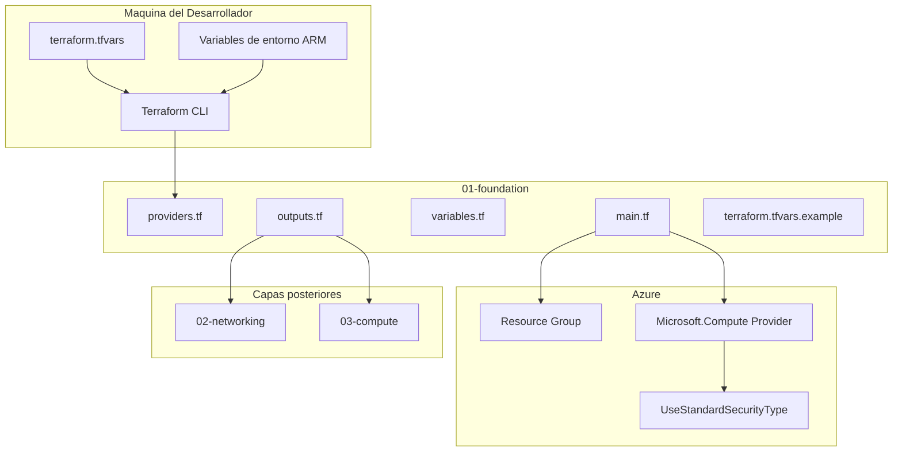
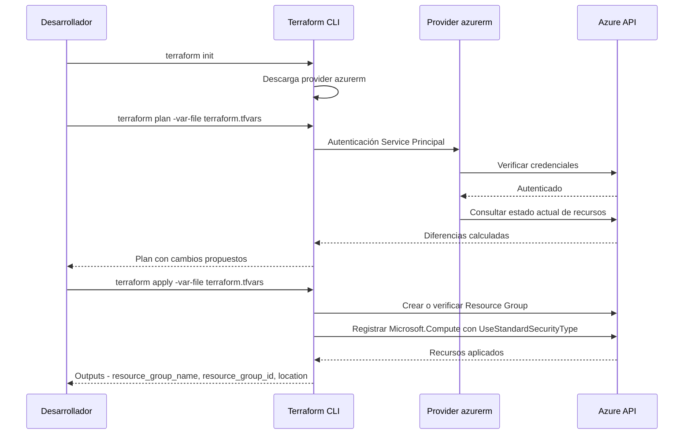

# Documento de Diseño — foundation

## Overview

**Propósito**: La capa `foundation` establece la base del despliegue de infraestructura Azure para el laboratorio de LLMs, provisionando el grupo de recursos y habilitando las features de suscripción necesarias para las capas posteriores.

**Usuarios**: El desarrollador del laboratorio ejecuta esta capa con Terraform desde su máquina local, autenticándose contra Azure mediante un Service Principal.

**Impacto**: Provisiona el estado base de la suscripción Azure: un grupo de recursos en la región objetivo y la feature `UseStandardSecurityType` habilitada para permitir VMs con `security_type = Standard` (sin Trusted Launch).

### Objetivos
- Provisionar idempotentemente el grupo de recursos para el laboratorio
- Registrar la feature `UseStandardSecurityType` y el provider `Microsoft.Compute` de forma idempotente
- Parametrizar toda la configuración sin valores hardcodeados
- Exponer outputs estables para consumo de las capas `networking` y `compute`

### No-Objetivos
- Creación de red, subredes, NSG o IP pública (Ola 2 `networking`)
- Creación de VM, NIC, discos o llaves SSH (Ola 3 `compute`)
- Configuración interna de la VM y Ollama (Ola 4 `vm-config`)
- Gestión de backend remoto de estado de Terraform
- Destrucción de recursos (Ola 5 `teardown-docs`)

## Boundary Commitments

### This Spec Owns
- Configuración del provider `azurerm` con autenticación no interactiva vía Service Principal
- Provisión idempotente del grupo de recursos con nombre, región y etiquetas parametrizadas
- Registro idempotente del provider `Microsoft.Compute` con la feature `UseStandardSecurityType`
- Declaración de todas las variables de entrada con tipo, descripción y defaults seguros
- Plantilla `terraform.tfvars.example` versionada en el repositorio
- Exposición de outputs `resource_group_name`, `resource_group_id`, `location`
- Restricciones de versión de Terraform (>= 1.5) y del provider azurerm (>= 4.0)

### Out of Boundary
- Provisión de redes, subredes, NSG, IP pública (spec `networking`)
- Provisión de VM, discos, NIC, llaves SSH (spec `compute`)
- Configuración de Ollama y scripts dentro de la VM (spec `vm-config`)
- Backend remoto de estado (Azure Storage Account u otro); ver decisión en `research.md`
- Destrucción del laboratorio (spec `teardown-docs`)
- Registro de otros providers o features no requeridos por esta capa

### Allowed Dependencies
- Terraform CLI >= 1.5 instalado en la máquina del desarrollador
- Provider `hashicorp/azurerm` >= 4.0
- Suscripción Azure con permisos para crear grupos de recursos y registrar features/providers (rol Contributor o equivalente)
- Credenciales de Service Principal (`client_id`, `client_secret`, `tenant_id`) provistas vía variables de Terraform o variables de entorno `ARM_*`

### Revalidation Triggers
- Cambio en los nombres, tipos o estructura de los outputs (`resource_group_name`, `resource_group_id`, `location`)
- Cambio en la interfaz de variables de autenticación del provider
- Cambio en la versión mínima requerida del provider azurerm
- Adición o eliminación de features registradas en `Microsoft.Compute`

## Architecture

### Architecture Pattern & Boundary Map

La capa `foundation` es un módulo Terraform plano (sin submódulos) que gestiona los recursos base de Azure. Sigue el patrón de capas independientes definido en el steering, donde cada capa tiene su propio state y se despliega de forma aislada.



**Decisiones de arquitectura**:
- **Módulo plano sin submódulos**: La capa tiene solo 2 recursos de Azure; abstraer en submódulos sería sobre-ingeniería
- **Estado local**: Se utiliza el backend local de Terraform. Las capas posteriores reciben los valores como variables de entrada (ver decisión completa en `research.md`)
- **Autenticación flexible**: Variables con `default = null` permiten al provider caer a env vars `ARM_*` cuando no se proveen vía `.tfvars`
- **`resource_provider_registrations = "none"`**: Desactiva el auto-registro de providers del provider azurerm para evitar conflictos con el recurso `azurerm_resource_provider_registration`

### Technology Stack

| Capa | Elección / Versión | Rol en la Feature | Notas |
|------|-------------------|-------------------|-------|
| IaC Runtime | Terraform >= 1.5 | Motor de infraestructura declarativa | Restricción vía `required_version` |
| Provider | hashicorp/azurerm >= 4.0 | Gestión de recursos Azure | Soporta `resource_provider_registrations` y bloques `feature` |
| Cloud | Azure (East US 2) | Plataforma destino | Región configurable vía variable `location` |

## File Structure Plan

### Directory Structure

```
terraform/
└── 01-foundation/
    ├── providers.tf               # Provider azurerm y restricciones de versión
    ├── main.tf                    # Grupo de recursos y registro de feature/provider
    ├── variables.tf               # Variables de entrada con tipo y descripción
    ├── outputs.tf                 # Outputs para capas posteriores
    └── terraform.tfvars.example   # Plantilla con valores de ejemplo
```

Archivos generados por Terraform (excluidos del repositorio vía `.gitignore`):
- `.terraform/` — providers descargados
- `terraform.tfstate`, `terraform.tfstate.backup` — estado local
- `terraform.tfvars` — valores reales del despliegue

### Modified Files

- `.gitignore` — Verificar que incluye exclusiones para `*.tfstate`, `*.tfstate.backup`, `.terraform/`, `*.tfvars` (excepto `*.tfvars.example`), `*.pem`

## System Flows

### Flujo de Terraform Apply



## Requirements Traceability

| Requisito | Resumen | Componentes | Interfaces | Flujos |
|-----------|---------|-------------|------------|--------|
| 1.1 | Crear grupo de recursos con nombre y región de variables | ResourceGroup | variables.tf | Apply |
| 1.2 | Idempotencia: segundo apply sin cambios | ResourceGroup | — | Plan post-apply |
| 1.3 | Reflejar recurso existente sin error de conflicto | ResourceGroup | — | Apply |
| 1.4 | Etiquetas vía variables sin valores fijos | ResourceGroup | variables.tf (`tags`) | Apply |
| 2.1 | Registrar feature `UseStandardSecurityType` | FeatureRegistration | — | Apply |
| 2.2 | Re-registrar provider `Microsoft.Compute` | FeatureRegistration | — | Apply |
| 2.3 | Idempotencia: feature ya registrada sin error | FeatureRegistration | — | Apply |
| 2.4 | Feature en estado `Registered` tras apply | FeatureRegistration | — | Apply |
| 3.1 | Autenticación no interactiva vía variables o env vars | ProviderConfig | variables.tf, env vars ARM_* | Init |
| 3.2 | `subscription_id` como variable de entrada | ProviderConfig | variables.tf | Init |
| 3.3 | Error claro si falta credencial, sin recursos parciales | ProviderConfig | — | Init |
| 4.1 | Todo valor como variable con tipo y descripción | Variables | variables.tf | — |
| 4.2 | Defaults seguros para variables no sensibles | Variables | variables.tf | — |
| 4.3 | Plantilla `.tfvars.example` versionada | VariablesTemplate | terraform.tfvars.example | — |
| 4.4 | Valores reales en `.tfvars` excluido de git | VariablesTemplate | .gitignore | — |
| 4.5 | Error si variable requerida sin valor ni default | Variables | — | Plan |
| 5.1 | Outputs: nombre, id y región del grupo de recursos | Outputs | outputs.tf | — |
| 5.2 | Nombres de outputs estables en `snake_case` | Outputs | outputs.tf | — |
| 5.3 | Outputs no sensibles | Outputs | outputs.tf | — |
| 6.1 | Plan cero cambios tras apply exitoso | Todos | — | Plan post-apply |
| 6.2 | Pasa `terraform validate` y `terraform fmt` | Todos | — | Validación |
| 6.3 | Reconcilia recurso eliminado externamente | ResourceGroup, FeatureRegistration | — | Apply |
| 6.4 | Código separado de valores de configuración | Todos | variables.tf, terraform.tfvars | — |

## Components and Interfaces

| Componente | Capa | Intención | Cobertura Req. | Dependencias Clave | Contratos |
|-----------|------|-----------|----------------|-------------------|-----------|
| ProviderConfig | Infraestructura | Configurar autenticación y versiones del provider azurerm | 3.1, 3.2, 3.3 | Azure API (P0) | Service |
| ResourceGroup | Infraestructura | Provisionar grupo de recursos idempotentemente | 1.1, 1.2, 1.3, 1.4 | ProviderConfig (P0) | State |
| FeatureRegistration | Infraestructura | Registrar feature y provider Microsoft.Compute | 2.1, 2.2, 2.3, 2.4 | ProviderConfig (P0) | State |
| Variables | Configuración | Declarar y validar parámetros de entrada | 4.1, 4.2, 4.5 | — | Service |
| VariablesTemplate | Configuración | Documentar variables sin exponer secretos | 4.3, 4.4 | — | — |
| Outputs | Interfaz | Exponer datos base para capas posteriores | 5.1, 5.2, 5.3 | ResourceGroup (P0) | Service |

### Infraestructura

#### ProviderConfig

| Campo | Detalle |
|-------|--------|
| Intención | Configurar el provider azurerm con autenticación no interactiva y restricciones de versión |
| Requisitos | 3.1, 3.2, 3.3 |

**Responsabilidades y restricciones**
- Declarar `terraform.required_version >= 1.5` y `azurerm >= 4.0` en el bloque `required_providers`
- Establecer `resource_provider_registrations = "none"` para gestionar registros manualmente
- Autenticar vía Service Principal con credenciales de variables o env vars `ARM_*`
- Si falta alguna credencial, Terraform falla en la fase de inicialización antes de crear recursos

**Dependencias**
- Externa: Azure API — autenticación y gestión de recursos (P0)

**Contratos**: Service [x]

##### Service Interface

```hcl
terraform {
  required_version = ">= 1.5"

  required_providers {
    azurerm = {
      source  = "hashicorp/azurerm"
      version = ">= 4.0"
    }
  }
}

provider "azurerm" {
  features {}

  subscription_id                 = var.subscription_id
  client_id                       = var.client_id
  client_secret                   = var.client_secret
  tenant_id                       = var.tenant_id
  resource_provider_registrations = "none"
}
```

- Precondiciones: Credenciales válidas de Service Principal disponibles (vía variables o env vars `ARM_*`)
- Postcondiciones: Provider autenticado contra la suscripción Azure indicada
- Invariantes: Falta de credenciales detiene la ejecución antes de cualquier operación sobre recursos

**Notas de implementación**
- Las variables `client_id`, `client_secret`, `tenant_id` tienen `default = null`; cuando son null, el provider lee `ARM_CLIENT_ID`, `ARM_CLIENT_SECRET`, `ARM_TENANT_ID` del entorno
- La variable `subscription_id` es obligatoria (sin default) por requisito 3.2

#### ResourceGroup

| Campo | Detalle |
|-------|--------|
| Intención | Provisionar el grupo de recursos de forma idempotente con etiquetas parametrizadas |
| Requisitos | 1.1, 1.2, 1.3, 1.4 |

**Responsabilidades y restricciones**
- Crear el grupo de recursos con nombre y región de variables de entrada
- Aplicar etiquetas de la variable `tags` (`map(string)`)
- Idempotencia nativa de Terraform: si el recurso existe con la misma configuración, no se modifica
- Si el recurso se elimina externamente, Terraform lo recrea en el siguiente apply

**Dependencias**
- Interna: ProviderConfig — autenticación Azure (P0)

**Contratos**: State [x]

##### State Management

```hcl
resource "azurerm_resource_group" "main" {
  name     = var.resource_group_name
  location = var.location
  tags     = var.tags
}
```

- Modelo de estado: Recurso gestionado en Terraform state local
- Persistencia: `terraform.tfstate` en el directorio de la capa
- Reconciliación: Eliminación externa del recurso produce un plan de recreación automática

#### FeatureRegistration

| Campo | Detalle |
|-------|--------|
| Intención | Registrar el provider Microsoft.Compute con la feature UseStandardSecurityType |
| Requisitos | 2.1, 2.2, 2.3, 2.4 |

**Responsabilidades y restricciones**
- Registrar el provider `Microsoft.Compute` en la suscripción
- Habilitar la feature `UseStandardSecurityType` con `registered = true`
- Terraform espera internamente hasta que la feature alcance el estado `Registered` (timeout de 2 horas)
- Solo features con `ApprovalType = "AutoApproval"` son gestionables; `UseStandardSecurityType` cumple este criterio

**Dependencias**
- Interna: ProviderConfig — autenticación Azure (P0)

**Contratos**: State [x]

##### State Management

```hcl
resource "azurerm_resource_provider_registration" "compute" {
  name = "Microsoft.Compute"

  feature {
    name       = "UseStandardSecurityType"
    registered = true
  }

  lifecycle {
    prevent_destroy = true
  }
}
```

- Modelo de estado: Recurso gestionado en Terraform state local
- Persistencia: `terraform.tfstate` en el directorio de la capa
- Reconciliación: Si la feature se desactiva externamente, Terraform la re-registra en el siguiente apply
- `lifecycle { prevent_destroy = true }`: Protege contra des-registro accidental durante `terraform destroy`. El registro del provider y la feature son a nivel de suscripción, no tienen costo, y des-registrarlos podría afectar otros recursos (regla global del steering)
- Nota: El registro de la feature puede tardar varios minutos; el provider azurerm gestiona la espera internamente

**Notas de implementación**
- **Prerequisito de primera ejecución**: `Microsoft.Compute` está registrado por defecto en suscripciones Azure activas. El primer `terraform apply` falla si el recurso no se importa previamente al state. Se debe ejecutar `terraform import azurerm_resource_provider_registration.compute /subscriptions/<subscription-id>/providers/Microsoft.Compute` antes del primer apply. Este paso es necesario una sola vez
- Una vez configurada, la feature no puede revertirse a un estado por defecto y debe permanecer en la configuración de Terraform
- Para la destrucción del laboratorio (Ola 5), `terraform destroy` en esta capa eliminará el resource group pero **no** des-registrará el provider gracias a `prevent_destroy`. Se requiere `terraform state rm azurerm_resource_provider_registration.compute` para limpiar el state sin afectar Azure
- Issue conocido [#31079](https://github.com/hashicorp/terraform-provider-azurerm/issues/31079): errores esporádicos de "inconsistent result after apply"; recuperables con re-ejecución de apply

### Configuración

#### Variables

| Campo | Detalle |
|-------|--------|
| Intención | Declarar todos los parámetros de entrada con tipo, descripción y defaults seguros |
| Requisitos | 4.1, 4.2, 4.5 |

**Responsabilidades y restricciones**
- Toda variable con tipo explícito y descripción en español
- Variables de autenticación (`client_id`, `client_secret`, `tenant_id`) marcadas con `sensitive = true`
- Variables opcionales con `default` seguro: `location` (`"eastus2"`), `tags` (`{}`)
- Variables obligatorias sin `default`: `subscription_id`, `resource_group_name`
- Terraform detiene la ejecución si falta un valor obligatorio

**Contratos**: Service [x]

##### Service Interface

```hcl
variable "subscription_id" {
  description = "Identificador de la suscripcion de Azure"
  type        = string
}

variable "client_id" {
  description = "Client ID del Service Principal. Si se omite, se usa ARM_CLIENT_ID"
  type        = string
  default     = null
  sensitive   = true
}

variable "client_secret" {
  description = "Client Secret del Service Principal. Si se omite, se usa ARM_CLIENT_SECRET"
  type        = string
  default     = null
  sensitive   = true
}

variable "tenant_id" {
  description = "Tenant ID de Azure AD. Si se omite, se usa ARM_TENANT_ID"
  type        = string
  default     = null
  sensitive   = true
}

variable "resource_group_name" {
  description = "Nombre del grupo de recursos a crear"
  type        = string
}

variable "location" {
  description = "Region de Azure donde crear el grupo de recursos"
  type        = string
  default     = "eastus2"
}

variable "tags" {
  description = "Etiquetas a aplicar al grupo de recursos"
  type        = map(string)
  default     = {}
}
```

- Precondiciones: `subscription_id` y `resource_group_name` siempre obligatorias
- Variables de autenticación: obligatorias solo si no se usan env vars `ARM_*`
- Invariantes: Terraform detiene la ejecución con mensaje claro si falta un valor obligatorio

#### VariablesTemplate

| Campo | Detalle |
|-------|--------|
| Intención | Documentar las variables de entrada sin contener valores reales |
| Requisitos | 4.3, 4.4 |

**Responsabilidades y restricciones**
- Archivo `terraform.tfvars.example` versionado en el repositorio
- Contiene todas las variables con valores placeholder que indican el formato esperado
- No contiene secretos ni valores reales
- El archivo `terraform.tfvars` (con valores reales) se excluye del repositorio vía `.gitignore`

**Notas de implementación**
- Incluir comentarios en la plantilla explicando cada variable y cuáles pueden omitirse si se usan env vars
- Los placeholders deben ser claramente identificables (e.g., `"xxxxxxxx-xxxx-xxxx-xxxx-xxxxxxxxxxxx"`)

### Interfaz

#### Outputs

| Campo | Detalle |
|-------|--------|
| Intención | Exponer los datos base del despliegue para consumo de capas posteriores |
| Requisitos | 5.1, 5.2, 5.3 |

**Responsabilidades y restricciones**
- Exponer exactamente tres outputs: `resource_group_name`, `resource_group_id`, `location`
- Nombres en `snake_case` siguiendo las convenciones del steering
- Información no sensible exclusivamente
- Las capas `networking` y `compute` reciben estos valores como variables de entrada

**Contratos**: Service [x]

##### Service Interface

```hcl
output "resource_group_name" {
  description = "Nombre del grupo de recursos creado"
  value       = azurerm_resource_group.main.name
}

output "resource_group_id" {
  description = "Identificador del grupo de recursos creado"
  value       = azurerm_resource_group.main.id
}

output "location" {
  description = "Region de Azure donde se creo el grupo de recursos"
  value       = azurerm_resource_group.main.location
}
```

## Error Handling

### Error Strategy

Los errores se gestionan mediante los mecanismos nativos de Terraform y del provider azurerm:

| Categoría | Ejemplo | Comportamiento |
|-----------|---------|---------------|
| Credenciales faltantes | Variable de autenticación sin valor y sin env var `ARM_*` | Terraform detiene la ejecución en `init`/`plan` con mensaje indicando el campo faltante |
| Variable obligatoria sin valor | `subscription_id` o `resource_group_name` omitidos | Terraform solicita el valor interactivamente o falla con `-input=false` |
| Permisos insuficientes | Service Principal sin rol Contributor | Error de Azure API con código 403; no se crean recursos parciales |
| Provider ya registrado | `Microsoft.Compute` existe en Azure pero no en state | `terraform apply` falla con "already exists"; ejecutar `terraform import` para sincronizar |
| Feature no propagada | Registro tarda más de lo esperado | El provider azurerm espera internamente (timeout 2h); timeout produce error recuperable |
| Estado inconsistente | Error esporádico "inconsistent result after apply" | Re-ejecutar `terraform apply`; error transitorio documentado en issue [#31079](https://github.com/hashicorp/terraform-provider-azurerm/issues/31079) |
| Recurso eliminado externamente | Grupo de recursos borrado entre ejecuciones | `terraform plan` detecta la diferencia y propone recrear |

## Testing Strategy

### Validación estructural
- `terraform validate` pasa sin errores en `terraform/01-foundation/`
- `terraform fmt -check` pasa sin diferencias de formato
- Archivos `.tf` siguen convenciones de nombrado: `kebab-case.tf`, variables en `snake_case`

### Validación de plan
- `terraform plan` con credenciales válidas genera un plan con los recursos esperados (`azurerm_resource_group`, `azurerm_resource_provider_registration`)
- `terraform plan` sin `terraform.tfvars` ni env vars falla solicitando `subscription_id`

### Validación de idempotencia
- Primer `terraform apply` crea el grupo de recursos y registra la feature
- `terraform plan` inmediato posterior reporta cero cambios (`0 to add, 0 to change, 0 to destroy`)

### Validación de reconciliación
- Eliminar el grupo de recursos manualmente (`az group delete --name <nombre> --yes`)
- Siguiente `terraform apply` recrea el grupo de recursos sin intervención manual

### Validación de outputs
- `terraform output resource_group_name` coincide con el valor de `var.resource_group_name`
- `terraform output resource_group_id` contiene el ID de Azure del recurso creado
- `terraform output location` coincide con el valor de `var.location`
