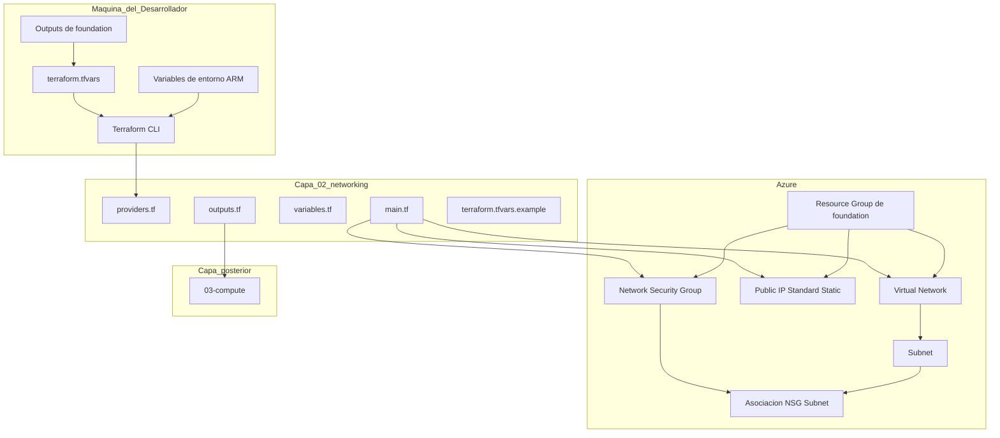
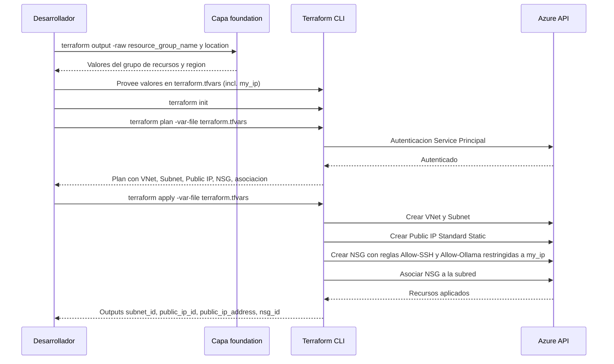

# Documento de Diseño — networking

## Overview

**Propósito**: La capa `networking` provisiona la red y la seguridad perimetral del laboratorio de LLMs, dejando disponible una red virtual con subred, una IP pública estable y un grupo de seguridad de red (NSG) que restringe el acceso entrante exclusivamente a la IP del desarrollador.

**Usuarios**: El desarrollador del laboratorio ejecuta esta capa con Terraform desde su máquina local, tras haber aplicado la capa `foundation`, autenticándose contra Azure mediante un Service Principal.

**Impacto**: Sobre el grupo de recursos creado por `foundation`, añade la infraestructura de red (VNet, Subnet, IP pública `Standard`/`Static`, NSG con reglas para SSH y Ollama) sobre la que la capa `compute` desplegará la VM GPU con conectividad segura.

### Objetivos
- Consumir el grupo de recursos y la región de `foundation` vía variables de entrada
- Provisionar idempotentemente VNet, Subnet, IP pública estática y NSG
- Restringir el acceso a los puertos 22 (SSH) y 11434 (Ollama) exclusivamente a la IP del desarrollador
- Aplicar el NSG dentro de esta capa (asociación a la subred) sin depender de `compute`
- Exponer outputs estables (`subnet_id`, `public_ip_id`, `public_ip_address`, `nsg_id`) para la capa `compute`
- Parametrizar toda la configuración sin valores hardcodeados

### No-Objetivos
- Creación de la NIC, la VM, discos o llaves SSH (Ola 3 `compute`)
- Asociación de la IP pública o del NSG a la NIC de la VM (propiedad de `compute`)
- Registro del grupo de recursos o de features/providers (Ola 1 `foundation`)
- Configuración interna de la VM y Ollama (Ola 4 `vm-config`)
- Backend remoto de estado de Terraform
- Destrucción de recursos (Ola 5 `teardown-docs`)

## Boundary Commitments

### This Spec Owns
- Configuración del provider `azurerm` con autenticación no interactiva (idéntico patrón a `foundation`)
- Provisión idempotente de la red virtual (`azurerm_virtual_network`) y la subred (`azurerm_subnet`)
- Provisión de la IP pública (`azurerm_public_ip`) con SKU `Standard` y asignación `Static`
- Provisión del NSG (`azurerm_network_security_group`) con reglas `Allow-SSH` (22) y `Allow-Ollama` (11434) restringidas a `var.my_ip`
- Asociación del NSG a la subred (`azurerm_subnet_network_security_group_association`)
- Declaración de todas las variables de entrada con tipo, descripción y defaults seguros, incluidas las de consumo de `foundation` (`resource_group_name`, `location`)
- Plantilla `terraform.tfvars.example` versionada
- Exposición de outputs `subnet_id`, `public_ip_id`, `public_ip_address`, `nsg_id`

### Out of Boundary
- Creación del grupo de recursos y registro de providers/features (spec `foundation`)
- Creación de la NIC, la VM, discos y llaves SSH (spec `compute`)
- Asociación de la IP pública y del NSG a la NIC/VM (spec `compute`)
- Configuración de Ollama y scripts dentro de la VM (spec `vm-config`)
- Backend remoto de estado (Azure Storage Account u otro)
- Destrucción del laboratorio (spec `teardown-docs`)

### Allowed Dependencies
- Terraform CLI >= 1.5 instalado en la máquina del desarrollador
- Provider `hashicorp/azurerm` >= 4.0
- Capa `foundation` **ya aplicada**: su grupo de recursos y región se consumen como variables de entrada (`resource_group_name`, `location`), obtenidas de sus outputs con `terraform -chdir=../01-foundation output -raw <output>`
- Namespace `Microsoft.Network` registrado en la suscripción (estándar en suscripciones activas; garantizado tras aplicar `foundation`)
- Credenciales de Service Principal vía variables de Terraform o variables de entorno `ARM_*`

### Revalidation Triggers
- Cambio en los nombres, tipos o estructura de los outputs (`subnet_id`, `public_ip_id`, `public_ip_address`, `nsg_id`) que consume `compute`
- Cambio en el mecanismo de consumo de `foundation` (variables de entrada → `terraform_remote_state`)
- Cambio en el ámbito de asociación del NSG (subred → NIC), que trasladaría la responsabilidad a `compute`
- Cambio en el espacio de direcciones de la subred (afecta la configuración IP de la NIC en `compute`)
- Cambio en los puertos expuestos o en la política de origen restringido a `my_ip`

## Architecture

### Existing Architecture Analysis

`networking` es la segunda capa del patrón de capas independientes definido en el steering. Respeta las restricciones existentes:
- **Dependencia hacia `foundation`**: consume su grupo de recursos y región como variables de entrada; no lee su state (decisión de estado local de `foundation`, ver `research.md`).
- **Patrón de capa hermana**: replica la estructura de archivos y la configuración del provider de `foundation` (`providers.tf`, `main.tf`, `variables.tf`, `outputs.tf`, `terraform.tfvars.example`), con su propio state local.
- **Punto de integración hacia `compute`**: expone outputs de red que `compute` consume como variables de entrada para construir la NIC.

### Architecture Pattern & Boundary Map

Módulo Terraform plano (sin submódulos) que gestiona cuatro recursos de red de Azure más una asociación. La abstracción en submódulos sería sobre-ingeniería para esta escala.



**Decisiones de arquitectura**:
- **Consumo de `foundation` vía variables de entrada**: `resource_group_name` y `location` se reciben como variables (no vía `terraform_remote_state`), en coherencia con la decisión de estado local de `foundation`. Resuelve el hallazgo del gap analysis. Ver `research.md`.
- **NSG asociado a la subred**: la aplicación de las reglas queda dentro de la frontera de `networking` mediante `azurerm_subnet_network_security_group_association`, sin depender de que `compute` asocie el NSG a la NIC.
- **Denegación por defecto**: no se crean reglas con origen `*`/`Internet` para los puertos 22 y 11434; el tráfico no autorizado queda bloqueado por la regla `DenyAllInbound` por defecto de todo NSG de Azure.
- **`resource_provider_registrations = "none"`**: consistente con `foundation`; se asume `Microsoft.Network` ya registrado.

### Technology Stack

| Capa | Elección / Versión | Rol en la Feature | Notas |
|------|-------------------|-------------------|-------|
| IaC Runtime | Terraform >= 1.5 | Motor de infraestructura declarativa | Restricción vía `required_version` |
| Provider | hashicorp/azurerm >= 4.0 | Gestión de recursos de red Azure | Mismo patrón de provider que `foundation` |
| Cloud | Azure (East US 2) | Plataforma destino | Región recibida como variable `location` desde `foundation` |

## File Structure Plan

### Directory Structure

```
terraform/
└── 02-networking/
    ├── providers.tf               # Provider azurerm y restricciones de version (patron de foundation)
    ├── main.tf                    # VNet, Subnet, Public IP, NSG y asociacion NSG-subred
    ├── variables.tf               # Variables de entrada con tipo, descripcion y validaciones
    ├── outputs.tf                 # Outputs de red para la capa compute
    └── terraform.tfvars.example   # Plantilla con valores de ejemplo (my_ip como placeholder)
```

Archivos generados por Terraform (excluidos del repositorio vía `.gitignore`):
- `.terraform/` — providers descargados
- `terraform.tfstate`, `terraform.tfstate.backup` — estado local
- `terraform.tfvars` — valores reales del despliegue (incluye `my_ip`)

### Modified Files

- Ninguno. El `.gitignore` de la raíz ya cubre `*.tfstate`, `*.tfstate.backup`, `.terraform/`, `*.tfvars` (excepto `*.tfvars.example`) y `*.pem`, por lo que aplica a esta capa sin cambios.

## System Flows

### Flujo de Terraform Apply



Nota: la denegación del resto del tráfico entrante a 22/11434 no requiere una regla explícita; la aplica la regla `DenyAllInbound` por defecto del NSG.

## Requirements Traceability

| Requisito | Resumen | Componentes | Interfaces | Flujos |
|-----------|---------|-------------|------------|--------|
| 1.1 | Obtener nombre del RG y región de outputs de `foundation` | FoundationInputs | variables.tf | Apply |
| 1.2 | Crear todos los recursos en el RG y región de `foundation` | FoundationInputs, VirtualNetwork, PublicIP, NetworkSecurityGroup | variables.tf | Apply |
| 1.3 | Error si falta la dependencia de `foundation` | FoundationInputs | variables.tf (`validation`) | Plan |
| 2.1 | Crear VNet y Subnet con espacios de direcciones de variables | VirtualNetwork | variables.tf | Apply |
| 2.2 | Idempotencia: segundo apply sin cambios | VirtualNetwork | — | Plan post-apply |
| 2.3 | Nombrar VNet y Subnet por convención vía variables | VirtualNetwork | variables.tf | — |
| 2.4 | Etiquetas de red vía variables sin valores fijos | VirtualNetwork | variables.tf (`tags`) | Apply |
| 3.1 | Crear IP pública con asignación estática | PublicIP | main.tf | Apply |
| 3.2 | IP persiste entre deallocate/start | PublicIP | — | Operación |
| 3.3 | Nombrar la IP pública por convención vía variable | PublicIP | variables.tf | — |
| 4.1 | Regla NSG SSH (22) solo desde `my_ip` | NetworkSecurityGroup | variables.tf (`my_ip`, `ssh_port`) | Apply |
| 4.2 | Regla NSG Ollama (11434) solo desde `my_ip` | NetworkSecurityGroup | variables.tf (`my_ip`, `ollama_port`) | Apply |
| 4.3 | `my_ip` y puertos como variables sin valores fijos | NetworkSecurityGroup, Variables | variables.tf | — |
| 4.4 | Error si `my_ip` no recibe valor; sin abrir al público | Variables | variables.tf (`validation`) | Plan |
| 4.5 | Ninguna regla permite 22/11434 desde otros orígenes | NetworkSecurityGroup | main.tf | Apply |
| 4.6 | Asociar NSG al ámbito de red sin depender de `compute` | NetworkSecurityGroup | main.tf | Apply |
| 5.1 | Outputs: subnet_id, public_ip (valor e id), nsg_id | Outputs | outputs.tf | — |
| 5.2 | Nombres de outputs estables en `snake_case` | Outputs | outputs.tf | — |
| 5.3 | Outputs no sensibles | Outputs | outputs.tf | — |
| 6.1 | Todo valor como variable con tipo y descripción | Variables | variables.tf | — |
| 6.2 | Defaults seguros para variables no sensibles | Variables | variables.tf | — |
| 6.3 | Plantilla `.tfvars.example` versionada | VariablesTemplate | terraform.tfvars.example | — |
| 6.4 | Valores reales (incl. `my_ip`) en `.tfvars` excluido de git | VariablesTemplate | .gitignore | — |
| 6.5 | Error si variable requerida sin valor ni default | Variables | variables.tf | Plan |
| 7.1 | Plan cero cambios tras apply exitoso | Todos | — | Plan post-apply |
| 7.2 | Pasa `terraform validate` y `terraform fmt` | Todos | — | Validación |
| 7.3 | Reconcilia recurso eliminado externamente | VirtualNetwork, PublicIP, NetworkSecurityGroup | — | Apply |
| 7.4 | Código separado de valores de configuración | Todos | variables.tf, terraform.tfvars | — |

## Components and Interfaces

| Componente | Capa | Intención | Cobertura Req. | Dependencias Clave | Contratos |
|-----------|------|-----------|----------------|-------------------|-----------|
| ProviderConfig | Infraestructura | Configurar autenticación y versiones del provider azurerm | 6.1 | Azure API (P0) | Service |
| FoundationInputs | Interfaz de entrada | Consumir grupo de recursos y región de `foundation` vía variables | 1.1, 1.2, 1.3 | foundation outputs (P0) | Service |
| VirtualNetwork | Infraestructura | Provisionar VNet y Subnet idempotentemente | 2.1, 2.2, 2.3, 2.4 | ProviderConfig (P0), FoundationInputs (P0) | State |
| PublicIP | Infraestructura | Provisionar IP pública estática y persistente | 3.1, 3.2, 3.3 | ProviderConfig (P0), FoundationInputs (P0) | State |
| NetworkSecurityGroup | Infraestructura | Crear NSG con reglas restringidas a `my_ip` y asociarlo a la subred | 4.1, 4.2, 4.3, 4.5, 4.6 | VirtualNetwork (P0) | State |
| Variables | Configuración | Declarar y validar parámetros de entrada | 4.3, 4.4, 6.1, 6.2, 6.5 | — | Service |
| VariablesTemplate | Configuración | Documentar variables sin exponer datos del entorno | 6.3, 6.4 | — | — |
| Outputs | Interfaz | Exponer datos de red para la capa `compute` | 5.1, 5.2, 5.3 | VirtualNetwork, PublicIP, NetworkSecurityGroup (P0) | Service |

### Infraestructura

#### ProviderConfig

| Campo | Detalle |
|-------|--------|
| Intención | Configurar el provider azurerm con autenticación no interactiva y restricciones de versión |
| Requisitos | 6.1 |

**Responsabilidades y restricciones**
- Declarar `terraform.required_version >= 1.5` y `azurerm >= 4.0`
- Establecer `resource_provider_registrations = "none"` (consistente con `foundation`)
- Autenticar vía Service Principal con credenciales de variables o env vars `ARM_*`

**Dependencias**
- Externa: Azure API — autenticación y gestión de recursos (P0)

**Contratos**: Service [x]

##### Service Interface

```hcl
terraform {
  required_version = ">= 1.5"

  required_providers {
    azurerm = {
      source  = "hashicorp/azurerm"
      version = ">= 4.0"
    }
  }
}

provider "azurerm" {
  features {}

  subscription_id                 = var.subscription_id
  client_id                       = var.client_id
  client_secret                   = var.client_secret
  tenant_id                       = var.tenant_id
  resource_provider_registrations = "none"
}
```

- Precondiciones: Credenciales válidas de Service Principal (vía variables o env vars `ARM_*`); `Microsoft.Network` registrado en la suscripción
- Postcondiciones: Provider autenticado contra la suscripción Azure indicada
- Invariantes: Falta de credenciales detiene la ejecución antes de operar sobre recursos

**Notas de implementación**
- Mismas variables de autenticación que `foundation` (`client_id`/`client_secret`/`tenant_id` con `default = null` y fallback a `ARM_*`; `subscription_id` obligatoria)
- Si `Microsoft.Network` no estuviera registrado: `az provider register --namespace Microsoft.Network` (una sola vez)

#### FoundationInputs

| Campo | Detalle |
|-------|--------|
| Intención | Consumir el grupo de recursos y la región producidos por `foundation` sin redeclararlos |
| Requisitos | 1.1, 1.2, 1.3 |

**Responsabilidades y restricciones**
- Declarar `resource_group_name` (obligatoria) y `location` (con default seguro `"eastus2"`) como variables de entrada
- Todos los recursos de esta capa se crean en ese grupo de recursos y región
- Validación fail-fast: si `resource_group_name` está vacío o ausente, Terraform detiene la ejecución en `plan`

**Dependencias**
- Externa: outputs de la capa `foundation` — `resource_group_name`, `location` (P0)

**Contratos**: Service [x]

##### Service Interface

```hcl
variable "resource_group_name" {
  description = "Nombre del grupo de recursos creado por la capa foundation (output resource_group_name)"
  type        = string

  validation {
    condition     = length(trimspace(var.resource_group_name)) > 0
    error_message = "resource_group_name es obligatorio; obtengalo con: terraform -chdir=../01-foundation output -raw resource_group_name"
  }
}

variable "location" {
  description = "Region de Azure de la capa foundation (output location)"
  type        = string
  default     = "eastus2"
}
```

- Precondiciones: `foundation` aplicada; sus outputs disponibles
- Postcondiciones: Recursos de red creados dentro del grupo de recursos de `foundation`
- Invariantes: Sin `resource_group_name` válido no se crea ningún recurso

**Notas de implementación**
- El desarrollador obtiene los valores con `terraform -chdir=../01-foundation output -raw resource_group_name` y `... -raw location`, y los coloca en `terraform.tfvars` (o `TF_VAR_*`)
- `Req 1.3` se materializa como validación de variable + fallo nativo de Terraform ante variable requerida ausente

#### VirtualNetwork

| Campo | Detalle |
|-------|--------|
| Intención | Provisionar la red virtual y la subred de forma idempotente |
| Requisitos | 2.1, 2.2, 2.3, 2.4 |

**Responsabilidades y restricciones**
- Crear `azurerm_virtual_network` con `address_space` de variable y `tags` de variable
- Crear `azurerm_subnet` con `address_prefixes` de variable dentro de la VNet
- Nombres de VNet y Subnet provistos por variables (convención `prefijo-funcion`)
- Idempotencia nativa de Terraform; reconciliación ante eliminación externa

**Dependencias**
- Interna: ProviderConfig — autenticación Azure (P0); FoundationInputs — grupo de recursos y región (P0)

**Contratos**: State [x]

##### State Management

```hcl
resource "azurerm_virtual_network" "main" {
  name                = var.vnet_name
  location            = var.location
  resource_group_name = var.resource_group_name
  address_space       = var.vnet_address_space
  tags                = var.tags
}

resource "azurerm_subnet" "main" {
  name                 = var.subnet_name
  resource_group_name  = var.resource_group_name
  virtual_network_name = azurerm_virtual_network.main.name
  address_prefixes     = var.subnet_address_prefixes
}
```

- Modelo de estado: recursos gestionados en Terraform state local
- Persistencia: `terraform.tfstate` en el directorio de la capa
- Reconciliación: eliminación externa produce un plan de recreación automática
- Nota: `azurerm_subnet` no admite `location` ni `tags` (propiedades no aplicables a subredes)

#### PublicIP

| Campo | Detalle |
|-------|--------|
| Intención | Provisionar una IP pública estática que persiste entre ciclos de desasignación |
| Requisitos | 3.1, 3.2, 3.3 |

**Responsabilidades y restricciones**
- Crear `azurerm_public_ip` con `sku = "Standard"` y `allocation_method = "Static"`
- Nombre provisto por variable (convención `prefijo-funcion`, p. ej. `vm-ollama-h100-pip`)
- El valor `ip_address` es conocido tras `apply` y se expone como output
- La IP se conserva mientras el recurso exista, independientemente del estado de la VM (`deallocate`/`start`)

**Dependencias**
- Interna: ProviderConfig — autenticación Azure (P0); FoundationInputs — grupo de recursos y región (P0)

**Contratos**: State [x]

##### State Management

```hcl
resource "azurerm_public_ip" "main" {
  name                = var.public_ip_name
  location            = var.location
  resource_group_name = var.resource_group_name
  allocation_method   = "Static"
  sku                 = "Standard"
  tags                = var.tags
}
```

- Modelo de estado: recurso gestionado en Terraform state local
- Persistencia: `terraform.tfstate` en el directorio de la capa
- Nota: el SKU `Standard` exige `allocation_method = "Static"`; esta combinación garantiza la persistencia de la IP entre `deallocate`/`start` de la VM (Req 3.2)

#### NetworkSecurityGroup

| Campo | Detalle |
|-------|--------|
| Intención | Crear el NSG con reglas restringidas a `my_ip` y asociarlo a la subred |
| Requisitos | 4.1, 4.2, 4.3, 4.5, 4.6 |

**Responsabilidades y restricciones**
- Crear `azurerm_network_security_group` con dos reglas `security_rule` inline:
  - `Allow-SSH`: entrante TCP al puerto `var.ssh_port` (22) desde `var.my_ip`
  - `Allow-Ollama`: entrante TCP al puerto `var.ollama_port` (11434) desde `var.my_ip`
- **No** crear ninguna regla con origen `*`/`Internet` para esos puertos (Req 4.5): el tráfico no autorizado lo deniega la regla `DenyAllInbound` por defecto de Azure
- Asociar el NSG a la subred con `azurerm_subnet_network_security_group_association` (Req 4.6), dentro de esta capa
- Puertos y `my_ip` provistos por variables (Req 4.3)

**Dependencias**
- Interna: VirtualNetwork — la subred a la que se asocia el NSG (P0)

**Contratos**: State [x]

##### State Management

```hcl
resource "azurerm_network_security_group" "main" {
  name                = var.nsg_name
  location            = var.location
  resource_group_name = var.resource_group_name
  tags                = var.tags

  security_rule {
    name                       = "Allow-SSH"
    priority                   = 1001
    direction                  = "Inbound"
    access                     = "Allow"
    protocol                   = "Tcp"
    source_port_range          = "*"
    destination_port_range     = tostring(var.ssh_port)
    source_address_prefix      = var.my_ip
    destination_address_prefix = "*"
  }

  security_rule {
    name                       = "Allow-Ollama"
    priority                   = 1002
    direction                  = "Inbound"
    access                     = "Allow"
    protocol                   = "Tcp"
    source_port_range          = "*"
    destination_port_range     = tostring(var.ollama_port)
    source_address_prefix      = var.my_ip
    destination_address_prefix = "*"
  }
}

resource "azurerm_subnet_network_security_group_association" "main" {
  subnet_id                 = azurerm_subnet.main.id
  network_security_group_id = azurerm_network_security_group.main.id
}
```

- Modelo de estado: recursos gestionados en Terraform state local
- Invariante de seguridad: el único origen permitido a 22/11434 es `var.my_ip`; no existe variable ni ruta para "abrir a internet"
- Nota: reglas inline `security_rule` (no se mezclan con recursos `azurerm_network_security_rule` separados)

### Configuración

#### Variables

| Campo | Detalle |
|-------|--------|
| Intención | Declarar todos los parámetros de entrada con tipo, descripción, defaults seguros y validaciones |
| Requisitos | 4.3, 4.4, 6.1, 6.2, 6.5 |

**Responsabilidades y restricciones**
- Toda variable con tipo explícito y descripción en español
- Variables de autenticación (`client_id`, `client_secret`, `tenant_id`) con `sensitive = true` y `default = null`
- `subscription_id`, `resource_group_name`, `my_ip` obligatorias (sin default)
- Defaults seguros: `location` (`"eastus2"`), nombres de recursos, espacios de direcciones, puertos (`ssh_port = 22`, `ollama_port = 11434`), `tags` (`{}`)
- Validación de formato de `my_ip` (CIDR) para fail-fast (Req 4.4)

**Contratos**: Service [x]

##### Service Interface

```hcl
variable "subscription_id" {
  description = "Identificador de la suscripcion de Azure"
  type        = string
}

variable "client_id" {
  description = "Client ID del Service Principal. Si se omite, se usa ARM_CLIENT_ID"
  type        = string
  default     = null
  sensitive   = true
}

variable "client_secret" {
  description = "Client Secret del Service Principal. Si se omite, se usa ARM_CLIENT_SECRET"
  type        = string
  default     = null
  sensitive   = true
}

variable "tenant_id" {
  description = "Tenant ID de Azure AD. Si se omite, se usa ARM_TENANT_ID"
  type        = string
  default     = null
  sensitive   = true
}

variable "my_ip" {
  description = "IP publica del desarrollador en formato CIDR (ej. 203.0.113.5/32) para restringir SSH y Ollama"
  type        = string

  validation {
    condition     = can(cidrhost(var.my_ip, 0)) && can(regex("/32$", var.my_ip))
    error_message = "my_ip debe ser una IP valida en formato CIDR /32, por ejemplo 203.0.113.5/32"
  }
}

variable "vnet_name" {
  description = "Nombre de la red virtual"
  type        = string
  default     = "vm-ollama-h100-vnet"
}

variable "subnet_name" {
  description = "Nombre de la subred"
  type        = string
  default     = "vm-ollama-h100-subnet"
}

variable "public_ip_name" {
  description = "Nombre de la IP publica"
  type        = string
  default     = "vm-ollama-h100-pip"
}

variable "nsg_name" {
  description = "Nombre del grupo de seguridad de red"
  type        = string
  default     = "vm-ollama-h100-nsg"
}

variable "vnet_address_space" {
  description = "Espacio de direcciones de la red virtual"
  type        = list(string)
  default     = ["10.0.0.0/16"]
}

variable "subnet_address_prefixes" {
  description = "Prefijos de direcciones de la subred"
  type        = list(string)
  default     = ["10.0.1.0/24"]
}

variable "ssh_port" {
  description = "Puerto SSH a permitir desde my_ip"
  type        = number
  default     = 22
}

variable "ollama_port" {
  description = "Puerto de la API de Ollama a permitir desde my_ip"
  type        = number
  default     = 11434
}

variable "tags" {
  description = "Etiquetas a aplicar a los recursos de red"
  type        = map(string)
  default     = {}
}
```

- Precondiciones: `subscription_id`, `resource_group_name` y `my_ip` siempre obligatorias
- Invariantes: Terraform detiene la ejecución con mensaje claro si falta un valor obligatorio o si `my_ip` no cumple el formato CIDR

#### VariablesTemplate

| Campo | Detalle |
|-------|--------|
| Intención | Documentar las variables de entrada sin contener valores reales del entorno |
| Requisitos | 6.3, 6.4 |

**Responsabilidades y restricciones**
- Archivo `terraform.tfvars.example` versionado con todas las variables y valores placeholder
- `my_ip` y valores de `foundation` (`resource_group_name`, `location`) como placeholders
- El `terraform.tfvars` real (incluida `my_ip`) se excluye del repositorio vía `.gitignore`

**Notas de implementación**
- Incluir comentarios que indiquen: cómo obtener `resource_group_name`/`location` desde `foundation`; que las credenciales `ARM_*` pueden ir por env vars; y que `my_ip` puede detectarse con `curl -s https://api.ipify.org` añadiendo `/32`

### Interfaz

#### Outputs

| Campo | Detalle |
|-------|--------|
| Intención | Exponer los datos de red para consumo de la capa `compute` |
| Requisitos | 5.1, 5.2, 5.3 |

**Responsabilidades y restricciones**
- Exponer `subnet_id`, `public_ip_id`, `public_ip_address`, `nsg_id`
- Nombres en `snake_case`; información no sensible
- La capa `compute` recibe estos valores como variables de entrada para construir la NIC

**Contratos**: Service [x]

##### Service Interface

```hcl
output "subnet_id" {
  description = "Identificador de la subred para la NIC de la VM"
  value       = azurerm_subnet.main.id
}

output "public_ip_id" {
  description = "Identificador de la IP publica"
  value       = azurerm_public_ip.main.id
}

output "public_ip_address" {
  description = "Direccion IP publica asignada"
  value       = azurerm_public_ip.main.ip_address
}

output "nsg_id" {
  description = "Identificador del grupo de seguridad de red"
  value       = azurerm_network_security_group.main.id
}
```

## Error Handling

### Error Strategy

Errores gestionados mediante los mecanismos nativos de Terraform y del provider azurerm:

| Categoría | Ejemplo | Comportamiento |
|-----------|---------|---------------|
| Variable requerida sin valor | `subscription_id`, `resource_group_name` o `my_ip` omitidos | Terraform solicita el valor o falla con `-input=false` (Req 1.3, 4.4, 6.5) |
| `my_ip` con formato inválido | Valor sin `/32` o no-CIDR | `validation` de la variable detiene la ejecución con mensaje explicativo |
| Credenciales faltantes | Auth sin variable ni env var `ARM_*` | Terraform detiene la ejecución en `plan` indicando el campo faltante |
| Grupo de recursos inexistente | `resource_group_name` no corresponde a un RG real | Azure API responde error al crear la VNet; no se crean recursos parciales |
| `Microsoft.Network` no registrado | Namespace ausente en la suscripción | Error de Azure API; mitigación: `az provider register --namespace Microsoft.Network` |
| Solapamiento de direcciones | `vnet_address_space` colisiona con otra red | Azure API rechaza la creación; ajustar la variable |
| Permisos insuficientes | Service Principal sin rol Contributor | Error 403; no se crean recursos parciales |
| Recurso eliminado externamente | NSG o VNet borrados entre ejecuciones | `terraform plan` detecta la diferencia y propone recrear (Req 7.3) |

## Testing Strategy

### Validación estructural
- `terraform validate` pasa sin errores en `terraform/02-networking/`
- `terraform fmt -check` pasa sin diferencias de formato
- Archivos `.tf` siguen convenciones: `kebab-case.tf`, variables en `snake_case`

### Validación de plan
- `terraform plan` con valores válidos genera un plan con `azurerm_virtual_network`, `azurerm_subnet`, `azurerm_public_ip`, `azurerm_network_security_group` y `azurerm_subnet_network_security_group_association`
- `terraform plan` sin `my_ip` falla solicitando la variable (Req 4.4)
- `terraform plan` con `my_ip` mal formada falla por la `validation` (Req 4.4)
- `terraform plan` sin `resource_group_name` falla solicitando la variable (Req 1.3)

### Validación de idempotencia
- Primer `terraform apply` crea los cinco recursos
- `terraform plan` inmediato posterior reporta cero cambios (`0 to add, 0 to change, 0 to destroy`) (Req 7.1)

### Validación de seguridad (reglas NSG)
- Las reglas `Allow-SSH` y `Allow-Ollama` tienen `source_address_prefix` igual a `var.my_ip` (Req 4.1, 4.2)
- No existe ninguna regla con `source_address_prefix` = `*` o `Internet` para los puertos 22/11434 (Req 4.5)
- El NSG está asociado a la subred (`azurerm_subnet_network_security_group_association` presente en el state) (Req 4.6)

### Validación de outputs
- `terraform output subnet_id` contiene el ID de la subred creada
- `terraform output public_ip_address` contiene una IP válida asignada
- `terraform output nsg_id` contiene el ID del NSG creado
- Los cuatro outputs alimentan las variables de entrada de la capa `compute` (Req 5.1)

### Validación de reconciliación
- Eliminar el NSG manualmente (`az network nsg delete ...`)
- Siguiente `terraform apply` recrea el NSG y su asociación sin intervención manual (Req 7.3)

## Security Considerations

- **Superficie mínima**: solo dos puertos entrantes (22, 11434), ambos restringidos a `var.my_ip`. La API de Ollama no tiene autenticación propia; la restricción por IP es la protección mínima (documentado en la guía base).
- **Denegación por defecto**: se confía en la regla `DenyAllInbound` de Azure; el diseño se compromete a no introducir reglas permisivas para esos puertos.
- **Sin secretos versionados**: `my_ip` y credenciales viven en `terraform.tfvars` (excluido de git) o en variables de entorno `ARM_*`/`TF_VAR_*`.
- **Fail-fast**: la `validation` de `my_ip` evita aplicar una configuración con un origen inválido o vacío.
